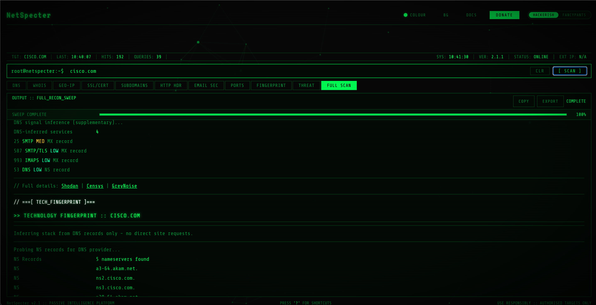

# NetSpecter v2.1

> Free browser-based OSINT & passive recon tool. No need to install anyting, no API keys needed, no backend.

## What is it?

NetSpecter is a passive intelligence platform that runs entirely on the browser.
Enter any domain or IP and run 11 recon modules: DNS enumeration, WHOIS,
geolocation, SSL cert analysis, subdomain discovery, HTTP header audit, email security
checks, port scanning, technology fingerprinting, and threat intelligence links.

No API keys required. Works on mobile.

## Live Demo

**[NetSpecter](https://netspecter-osint.github.io/NetSpecter/)**

## Modules

| Module | Description | API Used |
|---|---|---|
| DNS | Full record enumeration (A, AAAA, MX, NS, TXT, CNAME, SOA) | Google DNS-over-HTTPS |
| WHOIS | Domain registration data | HackerTarget |
| GEO-IP | IP geolocation, ASN, ISP, currency, UTC offset | ipapi.co |
| SSL/CERT | Certificate transparency log analysis, expiry, SANs | crt.sh |
| SUBDOMAINS | Passive subdomain discovery from CT logs and hostsearch | crt.sh + HackerTarget |
| HTTP HEADERS | Response header audit, security header scoring | HackerTarget |
| EMAIL SEC | SPF, DKIM (10 selectors), DMARC policy grading, MX audit | Google DoH |
| PORTS | Common port scan with risk flagging | HackerTarget (nmap) |
| FINGERPRINT | DNS-based tech stack inference - CDN, email provider, SaaS tools, hosting | Google DoH |
| THREAT | Pre-built deep links to VirusTotal, Shodan, AbuseIPDB, URLScan, GreyNoise etc. | (links only) |
| FULL SCAN | All 10 modules in sequence with progress bar | All of the above |

## Features

- 6 colour themes (green, blue, purple, pink, white, gray) persisted in localStorage
- 5 animated backgrounds (radar, network topology, hex dump, circuit board, CRT noise)
- Instantly check your public IP
- Export results as .txt
- Keyboard shortcuts (`?` to view)
- Fully responsive - works on mobile
- MIT licensed, fully open source

## Keyboard Shortcuts

| Key | Action |
|---|---|
| `Enter` | Focus input |
| `Esc` | Clear output |
| `E` | Export output as .txt |
| `C` | Copy output to clipboard |
| `1-9` (0) | Switch tab by number |
| `?` | Toggle this shortcuts panel |

## API Rate Limits

HackerTarget free tier allows ~100 queries per day per IP.
The DNS (Google DoH), GEO-IP (ipapi.co), and crt.sh modules are not subject to this limit.
If you hit the HackerTarget limit, WHOIS, HTTP Headers, Subdomains (partial), and Port Scan will return a warning with fallback links.

## Legal

This tool performs passive reconnaissance only.
All queries use public APIs and DNS lookups.
No active exploitation, injection, or unauthorised access is performed.
Only scan domains and IPs you own or have explicit written permission to test.

## Support

If this saved you time, consider buying me a coffee.

